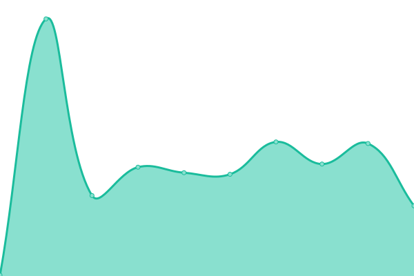

# [📈 Live Status](https://status.behn.cc): <!--live status--> **🟧 Partial outage**

This repository contains the open-source uptime monitor and status page for [Behn.cc Org](https://status.behn.cc), powered by [Upptime](https://github.com/upptime/upptime).

With [Upptime](https://upptime.js.org), you can get your own unlimited and free uptime monitor and status page, powered entirely by a GitHub repository. We use [Issues](https://github.com/Behn-cc-org/Status/issues) as incident reports, [Actions](https://github.com/Behn-cc-org/Status/actions) as uptime monitors, and [Pages](https://status.behn.cc) for the status page.

<!--start: status pages-->
<!-- This summary is generated by Upptime (https://github.com/upptime/upptime) -->
<!-- Do not edit this manually, your changes will be overwritten -->
<!-- prettier-ignore -->
| URL | Status | History | Response Time | Uptime |
| --- | ------ | ------- | ------------- | ------ |
|  [Root Site](https://behn.cc) | 🟩 Up | [root-site.yml](https://github.com/Behn-cc-org/Status/commits/HEAD/history/root-site.yml) | 

 148ms
     
 | 

<a href="https://status.behn.cc/history/root-site">100.00%</a>
    

|  [SSO](https://sso.behn.cc) | 🟩 Up | [sso.yml](https://github.com/Behn-cc-org/Status/commits/HEAD/history/sso.yml) | 

 819ms
     
 | 

<a href="https://status.behn.cc/history/sso">100.00%</a>
    

|  [GitLab](https://gitlab.infra.behn.cc) | 🟥 Down | [git-lab.yml](https://github.com/Behn-cc-org/Status/commits/HEAD/history/git-lab.yml) | 

 0ms
     
 | 

<a href="https://status.behn.cc/history/git-lab">0.00%</a>
    

<!--end: status pages-->

[**Visit our status website →**](https://status.behn.cc)

## 📄 License

- Powered by: [Upptime](https://github.com/upptime/upptime)
- Code: [MIT](./LICENSE) © [Behn.cc Org](https://status.behn.cc)
- Data in the `./history` directory: [Open Database License](https://opendatacommons.org/licenses/odbl/1-0/)
